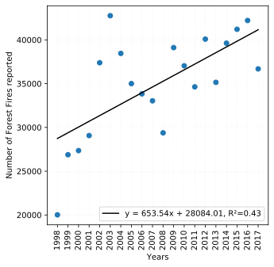
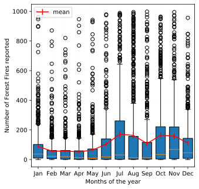
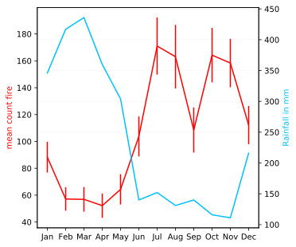
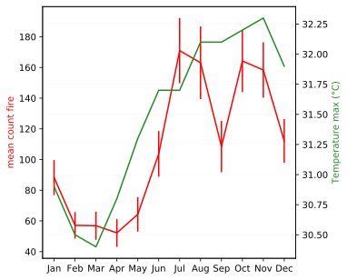

# Forest Fires in Brazil

Sources des données : https://www.kaggle.com/gustavomodelli/forest-fires-in-brazil
Feux signalés pour chaque mois sur dix années entre 1998 et 2017 et par régions au Brésil.

En 2011 (cf. The World Factbook de 2011), la superficie forestière pour Brésil est de 4 776 980 km² de forêts.

## Nombre de feu signalé pour l'année entre 1998 et 2017

Le nombre de feux signalés pour la période 1998 à 2017 a été multiplié par 1.5. Il y a donc une tendance à la hausse du nombre de feux signalés pour cette période. 

  
  Fig. 1 Nombre de feu signalé pour l'année entre 1998 et 2017

## Moyenne des feux signalés pour chaque mois de l'année

Nous constatons une moyenne de feux signalés plus élevés les mois de juillet à décembre. Environs 40% plus élevés par rapport à la période Janvier-Juin.

  
  Fig. 2 Pour chaque mois de l'année le nombre de feux signalés. Boxplot et moyenne avec l'intervalle de confiance à 95%.

## Corrélation avec les conditions météorologiques

Les données utilisées pour les conditions météorologiques correspondent à un climat équatorial : pluviométrie et la température maximum. (source:https://fr.wikipedia.org/wiki/Climat_du_Br%C3%A9sil#Le_climat_%C3%A9quatorial)

<table>
  <tr>
    <td>

    
    Fig. 3 Pour chaque mois de l'année le nombre de feux signalés et la pluviométrie (mm). Coefficient de corrélation r = -0.87.
    

    </td>
    <td>

    
    Fig. 4 Pour chaque mois de l'année le nombre de feux signalés et la température maximum observé. Coefficient de corrélation r = 0.84.
    

    </td>
  </tr>
</table>

## Modélisation

